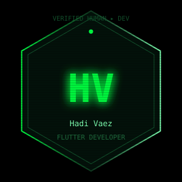
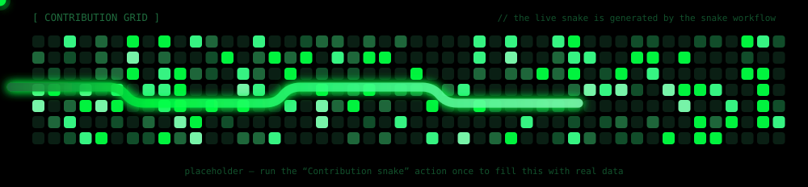

<!-- ═══════════════════════════════════════════════════════════════════════════
     Hadi Vaez — profile README
     generated from tools/profile.config.json  ·  rebuild: cd tools && npm run build
     ═══════════════════════════════════════════════════════════════════════════ -->

## ⚡ About

<table>
<tr>
<td width="230" align="center" valign="top">

</td>
<td valign="top">

| | |
|:--|:--|
| 🖥️ &nbsp;Role | Flutter Developer · Mobile Engineer |
| 📍 &nbsp;Based in | Tehran, Iran · UTC+03:30 |
| 🧠 &nbsp;Currently building | cross-platform apps with Flutter |
| 📚 &nbsp;Currently learning | Kotlin, Swift, Clean Architecture |
| 🧰 &nbsp;Daily drivers | Flutter · Dart · Firebase · REST API |
| 🤝 &nbsp;Open to | Freelance · Full-time ✅ |

> I build apps that feel alive.

</td>
</tr>
</table>

## 📡 Live now

## 🖥️ Boot sequence

## 🧬 Stack

## 📊 Skills

## 🚀 Projects

| Project | What it is | Stack | Status |
|:--|:--|:--|:--|
| **[Eflutter](https://github.com/vaezhadi/Eflutter)** | Flutter playground — experiments, widgets and app skeletons. | `Flutter · Dart` | `ACTIVE` |

## 📈 GitHub telemetry

## 🌐 Contribution skyline

## 🐍 Contribution grid, but it plays snake

## 💬 One line I live by

> **Talk is cheap. Show me the code.**

built in the dark, with ❤️ and too much ☕ — see you in the commits

